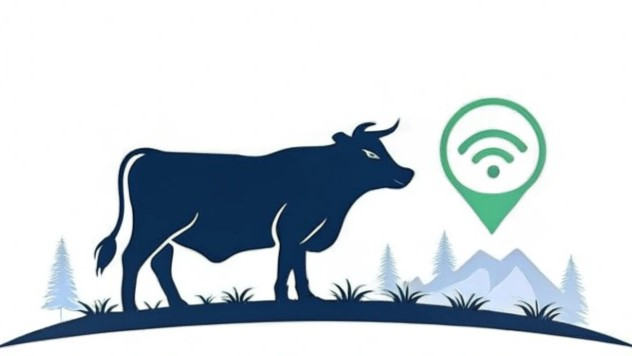

# 🐄 CowFindr — Smart Collar for Precision Livestock Farming

**CowFindr** is a non-invasive smart collar designed to revolutionize livestock management in rural areas through real-time monitoring of biometric and environmental parameters. Built with cutting-edge technologies like **IoT**, **Artificial Intelligence**, **solar energy**, and **nanotechnology**, CowFindr helps detect early health risks and improve animal welfare and productivity.

> 💡 **Built with:** ESP32, GPS, IMU, THI sensors.

---

## 🚀 Live Demo

🟢 You can now visit the live demo here :https://cow-findr.vercel.app/

---

## 📘 Introduction

The livestock industry faces increasing challenges in health control, efficiency, and animal welfare—especially in rural zones. CowFindr proposes a complete solution with:

- Biometric + environmental monitoring  
- Real-time alerts for diseases, estrus, and prepartum  
- GPS tracking and IoT connectivity  
- Solar energy autonomy and nanotechnology protection  

Aimed at transforming livestock into a **proactive, automated, and data-driven** industry.

---

## 🎯 Objectives

### General
Develop a smart, non-invasive collar capable of real-time biometric and environmental monitoring to enable predictive and sustainable herd management.

### Specific
1. Design a sensor-integrated, portable and autonomous device for livestock.
2. Apply AI to detect abnormal behavior or early illness indicators.
3. Ensure durability and energy efficiency with solar energy and functional nanocoating.

---

## 🧪 Hypothesis

The integration of biometric/environmental sensors, GPS,IoT in CowFindr will allow early and accurate detection of health issues, reducing losses and enhancing animal welfare in rural environments.

---

## 🔧 Project Development

### 🧠 Embedded System

- **Microcontroller:** ESP32 for low-power dual-core processing + Wi-Fi
- **Sensors:**
  - BMX160 (9-axis IMU)
  - BMP388 (temperature & pressure for THI)
  - GY-GPS6MV2 (real-time GPS)
- **Communication:** I²C + UART + MQTT over Wi-Fi
- **Firmware:** Developed in Arduino IDE with interrupt-based routines, deep sleep cycles, and thresholding logic
- **THI modeling:** Combines BMP388 data + external weather APIs (e.g. NOAA)

### 🌐 Web Platform

- **Frontend:** Built with Next.js (React) + Vercel for CI/CD
- **Backend:** Firebase (Firestore, Authentication, Cloud Storage)
- **Features:**
  - Real-time dashboards (temperature, motion, THI, GPS)
  - Secure user access for farmers/researchers
  - Map view via Leaflet or Google Maps
  - Alerts generated by AI-based risk predictions

### ⚗️ Nanotechnology Coating

- **TiO₂** (UV protection), **ZnO** (antimicrobial), **SiO₂** (hydrophobic)
- Applied via **dip-coating** in epoxy matrix (EPON 828 + DETA)
- Validated through:
  - Hydrophobicity test (contact angle > 100°)
  - UV resistance (UV-A lamp)
  - Antimicrobial activity (Kirby-Bauer)
  - Mechanical durability (ASTM D3359)

### 🧩 Physical Design

- CAD modeled in **SolidWorks**
- 3D printed semiflexible collar using polymer materials
- Integrated curved **semiflexible solar panel** + power manager
- Tested for animal ergonomics, durability, and real-world fit

---

## 📈 Expected Results

- ✅ Accurate GPS and motion-based health tracking
- ✅ Automated alerts for estrus, prepartum, distress
- ✅ Reduced economic losses and improved animal care
- ✅ Workload reduction for farmers
- ✅ Environmental sustainability through solar + data-driven decisions

---

## ⚙️ Technologies Used

| Area          | Tools / Tech                     |
|---------------|----------------------------------|
| Firmware      | Arduino IDE, C++, MQTT, IMU/GPS |
| AI / Inference| Thresholds (onboard), scalable ML |
| Web frontend  | Next.js, React, Vercel           |
| Backend       | Firebase, Firestore              |
| Dashboard     | Recharts, Chart.js, Leaflet      |
| Hardware      | ESP32, Solar, Sensors, 3D Print  |
| CAD & Coating | SolidWorks, TiO₂ / ZnO / SiO₂    |

> 🐮 *CowFindr – The smart collar for a healthier, smarter herd.*
